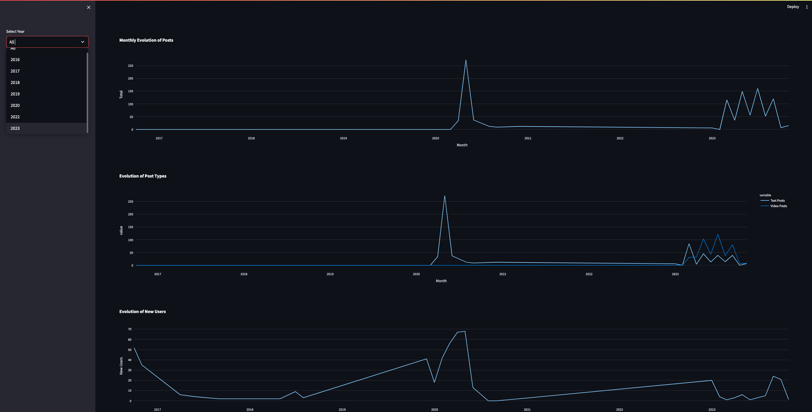

# Dashboard (Users x Posts)

This repository contains the backend and dashboard for visualizing post and user activity data for the Posts platform.

## Overview

The Dashboard provides insights into the usage patterns, growth metrics, and overall activity on the Posts platform. It uses a Python backend to serve up the data, which is then visualized using Streamlit.

## Getting Started

To get a local copy up and running, follow these simple steps.

### Prerequisites

- Python 3.9+
- PostgreSQL
- pip/pip3

## Line Chart

